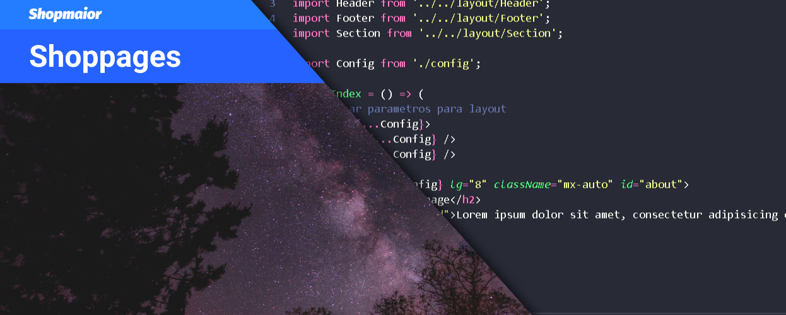

# Shoppages

## Use
### Fork this repository

### Clone
`git clone https://github.com/[Your]/shoppages`

### Install dependencies
`yarn` or `npm install`

### Start develop server
`yarn dev` or `npm run dev`

## CLI for create new page
`yarn create-page` or `npm run create-page` 